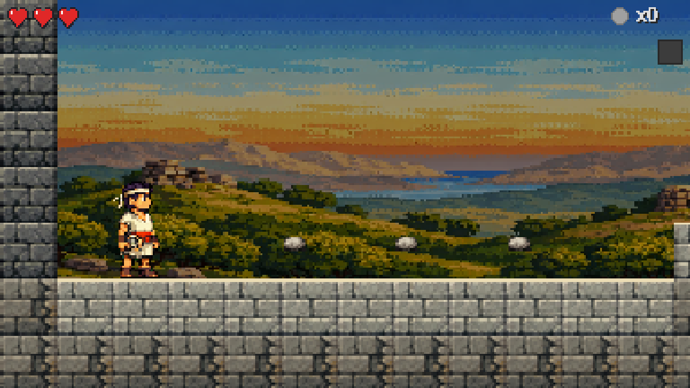

<p align="center">
  
</p>

<p align="center">
  <strong>A 2D retro side-scrolling platformer set across the Balearic Islands</strong>
</p>

<p align="center">
  
  
  
  
</p>

---

Sa Fona is a pixel-art platformer with combat, set across different historical eras of the Balearic Islands. You play as **Balchar**, a grumpy talayotic slinger cursed into time-traveling alongside **Bep**, his myotragus companion who accidentally ate a dimoni's sacred herbs.

## Download

**[Play Sa Fona on itch.io](https://TODO-SET-ITCHIO-URL.itch.io/sa-fona)** — standalone builds for Windows and Linux, no Python required.

<p align="center">
  
</p>

## Story

Balchar was napping against a talayot when Bep wandered to a dimoni's altar and ate its sacred herbs. Es Dimoni de Sant Joan, furious, cursed Bep — granting him speech and turning him into a time-travel trigger. Now every dimoni on the island wants a piece of Bep, and Balchar is dragged along for the ride through Mallorca's history: from the talayotic era to Roman occupation, the age of pirates, and beyond.

## Features

- Side-scrolling platformer with sling-based combat
- Multiple worlds spanning Balearic history
- Boss encounters with unique mechanics
- Mask power-up system (Stone Slam, Double Jump, Fire Dash, and more)
- NPC interactions and a shop system
- Data-driven cutscenes and dialogue
- Parallax scrolling backgrounds
- Checkpoint and save system
- 16-bit pixel art style (SNES era)

## Requirements

- Python 3.11+
- Pygame 2.6+

## Installation

```bash
git clone https://github.com/JavaLavadora/SaFona.git
cd SaFona

# Create a conda environment (recommended)
conda create -n safona python=3.11
conda activate safona

# Install dependencies
pip install pygame
```

## Running the Game

```bash
conda activate safona
python -m sa_fona.main
```

### Command-line options

```bash
python -m sa_fona.main                     # Normal start (main menu)
python -m sa_fona.main --level world1/level_1_1  # Jump to a specific level
python -m sa_fona.main --boss bou_de_pedra       # Jump to a boss fight
```

## Controls

| Action       | Key                  |
|-------------|----------------------|
| Move        | Arrow keys / A, D    |
| Jump        | Space                |
| Attack      | X                    |
| Interact    | Enter                |
| Mask Power  | Z                    |
| Pause       | Escape               |

## Project Structure

```
sa_fona/
  config/       # Settings and constants
  core/         # Game loop, input, events, scene management
  data/         # Levels, dialogue, cutscenes, boss definitions (JSON)
  entities/     # Player, enemies, NPCs, bosses, companions
  rendering/    # Sprites, effects, asset loading, parallax
  scenes/       # Menu, gameplay, boss, cutscene, level select
  systems/      # Physics, combat, economy, masks, triggers, saves
  ui/           # HUD, dialogue box, transitions
assets/         # Sprites, tilesets, portraits, UI, backgrounds
tests/          # Test suite
docs/           # GDD, architecture, roadmap
```

## Development

Sa Fona is developed using an AI-assisted multi-agent workflow. See [CLAUDE.md](CLAUDE.md) for details on the development process and team structure.

```bash
# Run tests
python -m pytest tests/ -x -q

# Run with a specific display (headless/remote)
Xvfb :99 -screen 0 1152x648x24 &
DISPLAY=:99 python -m sa_fona.main
```

## Building for Distribution

Sa Fona can be packaged as a standalone executable using PyInstaller. See [docs/distribution.md](docs/distribution.md) for the full build and upload guide.

```bash
conda activate safona
pip install pyinstaller
./build.sh linux    # produces dist/SaFona-linux.zip
```

## License

This project is licensed under the [GPL-3.0 License](LICENSE).
