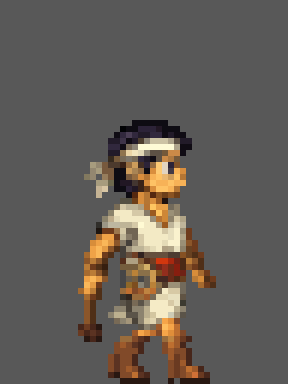
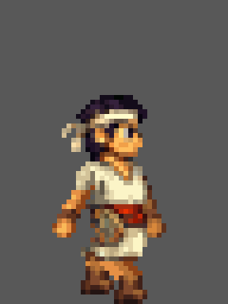
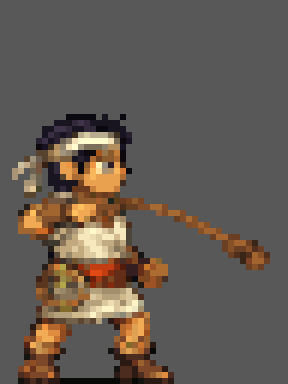
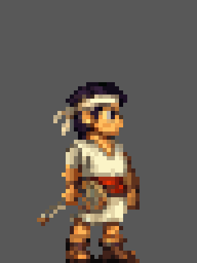
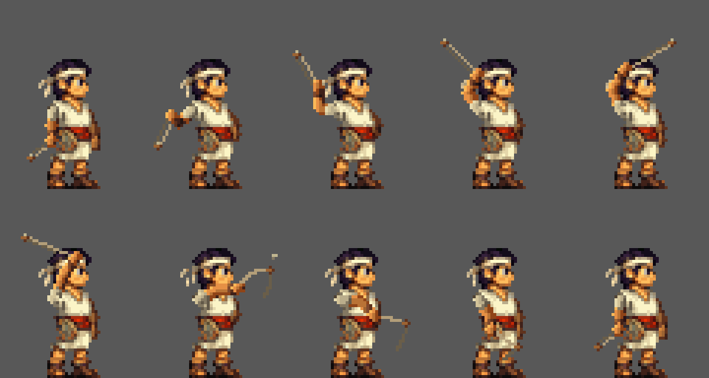

# Balchar — editable animation finals

Eleven native **48x64 RGBA** files: nine animation types, with two independent
walk alternatives and two independent sling alternatives. Other animations
are stored once. Each file has one forward tag matching its filename,
local frames 1 through the listed count,
and repeat value 0. Neither pair has a runtime selection.

| File / tag | Frames | Duration per frame | Editable layers |
| --- | ---: | --- | ---: |
| [idle.aseprite](idle.aseprite) / `idle` | 4 | 150 ms | 7 |
| [walk_fixed.aseprite](walk_fixed.aseprite) / `walk_fixed` | 6 | 100 ms; 600 ms cycle | 15 |
| [walk_parallel.aseprite](walk_parallel.aseprite) / `walk_parallel` | 8 | 90 ms; 720 ms cycle | 7 |
| [jump.aseprite](jump.aseprite) / `jump` | 2 | 150 ms | 7 |
| [wall_slide.aseprite](wall_slide.aseprite) / `wall_slide` | 2 | 150 ms | 7 |
| [wall_jump.aseprite](wall_jump.aseprite) / `wall_jump` | 2 | 150 ms | 7 |
| [sling_attack.aseprite](sling_attack.aseprite) / `sling_attack` | 4 | 300, 100, 100, 200 ms | 15 |
| [hit.aseprite](hit.aseprite) / `hit` | 1 | 400 ms | 7 |
| [death.aseprite](death.aseprite) / `death` | 1 | 600 ms | 7 |
| [crouch.aseprite](crouch.aseprite) / `crouch` | 2 | 150 ms | 7 |
| [sling_attack_parallel.aseprite](sling_attack_parallel.aseprite) / `sling_attack_parallel` | 10 | 150, 120, 100, 80, 60, 60, 70, 100, 110, 150 ms; 1000 ms total | 10 |

Both walk tags map to canonical animation `walk`. The fixed walk preserves
the existing six-pose gait; the parallel walk preserves the eight-pose gait
with solid boot soles, thicker legs, and larger hands. Final idle frame 1 is
the character reference; native foot-contact baseline is y=63. Selection and
art approval are separate from packaging. Both sling tags map to canonical
animation `sling_attack`; the four-frame source and ten-frame authored
alternative remain independently available.

## Editability and provenance

The original ten files (`idle` through `crouch` in the table) are lossless
slices of supplied animation documents. In those ten files, all retained
cel bytes (including partial alpha and hidden RGB), dimensions,
positions, opacity, z-index, palette colors, layer properties/order, timing,
and image-link relationships match those sources. No flattening,
palette clamp, cropping, recentering, or artwork edits are applied.
The fixed walk and four-frame sling retain all 15 original layer slots,
including empty ones: their nonzero cel z-index offsets depend on absolute
layer positions. Other lossless slices omit only wholly unused layers.
Seven-layer animations retain their body-part separation, not a flattened render.

The parallel sling is **authored from reference**, not losslessly extracted
from idle or copied from the four-frame sling. Its sole visual reference is
[idle.aseprite](idle.aseprite), **frame 1**. The raster artwork is directly
authored via Aseprite MCP, retaining the idle identity, planted leg pixels,
and native RGBA style; there is no embedded rig. Ten ordered part layers and
100 full-canvas cels include intentional empty cels. The 15-entry project
palette is preserved without clamping the richer RGBA artwork. The complete
pose, timing, layer and registration design lives only in the
[parallel sling specification](../../../docs/asset_prompts/shared.md#161-parallel-sling-alternative-10-frames).

[final_manifest.json](final_manifest.json) records SHA-256 hashes, native
timelines, layer order, canonical mappings, and original document hashes/tag
spans. Historical document names in the lossless entries are provenance
identifiers, not paths to checkpoint files in this folder. Schema version 1
has an additive `derivation` / `authoring` extension: entries without
`derivation` retain their original lossless-slice semantics;
`derivation: authored_from_reference` means `source.frames: [1, 1]` identifies
one visual-reference frame, **not the output extraction range**. The authored
entry separately records its ten-frame timeline and release cue.

## Current review previews

Native strips retain the exact rendered RGBA frames. GIFs are 6x
nearest-neighbor previews on opaque **#585858**, looping forward at source
timing. Their decoded pixels match Aseprite's native gray composite exactly;
they are not editable masters.

| Animation | Native strip | Motion preview |
| --- | --- | --- |
| Fixed walk | [preview/walk_fixed.png](preview/walk_fixed.png) — 288x64 | [preview/walk_fixed.gif](preview/walk_fixed.gif) |
| Parallel walk | [preview/walk_parallel.png](preview/walk_parallel.png) — 384x64 | [preview/walk_parallel.gif](preview/walk_parallel.gif) |
| Sling attack | [preview/sling_attack.png](preview/sling_attack.png) — 192x64 | [preview/sling_attack.gif](preview/sling_attack.gif) |
| Parallel sling | [preview/sling_attack_parallel.png](preview/sling_attack_parallel.png) — 480x64 | [preview/sling_attack_parallel.gif](preview/sling_attack_parallel.gif) — 288x384 |

The [parallel sling pose sheet](preview/sling_attack_parallel_poses.png) is
1200x640, five columns by two rows at 5x, in frame order on opaque #585858.
The GIF loops the 1000 ms sequence for review only; the action is designed
as one-shot, not automatic reload/firing logic. The release cue is frame 7
at 570 ms. Its indexed preview uses 132 opaque RGB colors and reserved
transparent index 0; the decoded gray composite is exact, not the master's
RGBA representation.

## Runtime boundary

Existing raw PNGs and processed game sprites are unchanged. The game does not
load these Aseprite files; the processing config and runtime sling PNG still
describe three sling frames. Walk/sling selection and PNG/config/engine-manifest
integration require a separate change.

See [canonical Balchar specifications](../../../docs/asset_prompts/shared.md#1-balchar-player-character)
and the [asset workflow](../../../docs/asset_generation_guide.md).