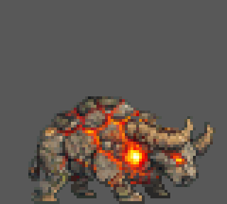

# Bou de Pedra — editable animation finals

Ten native **80x72 RGBA** files, 25 frames in total. Each file has one forward
tag matching its filename, local frames 1 through the listed count, and repeat
value 0. The existing aligned idles, alpha cleanup, and polished four-pose
rush are preserved without any further artwork changes.

| File / tag | Frames | Duration per frame | Editable layers |
| --- | ---: | --- | ---: |
| [idle_p1.aseprite](idle_p1.aseprite) / `idle_p1` | 4 | 250 ms | 1 |
| [idle_p2.aseprite](idle_p2.aseprite) / `idle_p2` | 4 | 250 ms | 1 |
| [idle_p3.aseprite](idle_p3.aseprite) / `idle_p3` | 4 | 250 ms | 1 |
| [rush.aseprite](rush.aseprite) / `rush` | 4 | 100 ms; 400 ms cycle | 5 |
| [headbutt.aseprite](headbutt.aseprite) / `headbutt` | 2 | 250 ms | 1 |
| [stomp.aseprite](stomp.aseprite) / `stomp` | 2 | 250 ms | 1 |
| [hurl.aseprite](hurl.aseprite) / `hurl` | 1 | 250 ms | 1 |
| [stunned.aseprite](stunned.aseprite) / `stunned` | 1 | 250 ms | 1 |
| [transition.aseprite](transition.aseprite) / `transition` | 1 | 250 ms | 1 |
| [death.aseprite](death.aseprite) / `death` | 2 | 250 ms | 1 |

The 250 ms non-idle values are editor-preview defaults, not runtime attack or
recovery timing. Idles retain their common ground registration at native
baseline y=71. Rush references final idle_p3 frame 1; its phases are contact,
compression, hindpush, and gather. The fixed torso/head and articulated legs
retain the supplied movement, including existing stone shading and joins.

## Editability and provenance

Rush retains separate `rush` (body), `rush_head_horns`, `rush_legs_near`,
`rush_legs_far`, and `rush_tail` layers in their original order. Other
animations retain their original single image layer; no anatomical separation
is claimed for them. Only wholly unused layers are omitted.

All retained raw cel pixels (including hidden RGB and partial alpha), cel
positions/dimensions/opacity/z-index, layer properties, image links, timing,
and palette colors match the supplied document. No flattening, cropping,
recentring, palette clamp, filtering, or redraw is applied. The 245-entry
editor palette does not limit the source's full RGBA colors.

[final_manifest.json](final_manifest.json) records final hashes, native
timelines, layer order, and the original document hash/tag/frame spans.
Its source document name is a provenance identifier, not a checkpoint link.

## Current review preview

- [preview/rush.png](preview/rush.png): exact native 320x72 RGBA strip.
- [preview/rush.gif](preview/rush.gif): 320x288, 4x nearest-neighbor preview
  on opaque **#585858**, four 100 ms frames, infinite forward loop. GIF color
  quantization is preview-only; use the PNG or editable source for exact colors.

## Runtime boundary

Raw source PNGs, processed sprites, configs, and engine metadata are unchanged.
The runtime rush PNG/config still has two frames; the engine manifest retains
its legacy one-frame death entry and omits hurl. These native files do not
silently change runtime playback. PNG/config/manifest integration is separate.

See [canonical Bou de Pedra specifications](../../../docs/asset_prompts/world1.md#3-bou-de-pedra-world-1-boss)
and the [asset workflow](../../../docs/asset_generation_guide.md).